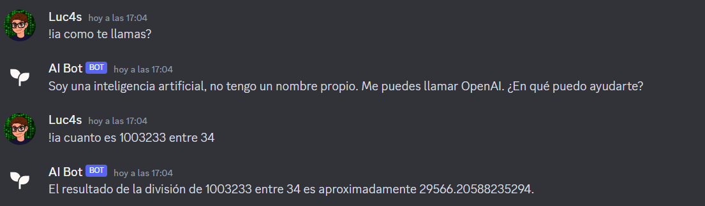

# BotAi Discord | Con ChatGPT OpenAi

Para ejecutar este código necesitas instalar python en tu ordenador.

Primero debes instalar openai y discord.py,
 para eso escribe en consola: `pip install openai discord.py`

Segundo crea una clave de OpenAI en https://platform.openai.com
Tercero crea un bot de discord y obten en el token en https://discord.dev

Por último edita el archivo `config.py` y ejecuta el código.

Todos los derechos reservados a [Luc4s Dev](https://luc4s.dev)